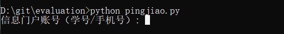

===========================================  
武汉大学评教脚本（2024年春季）
===========================================  
# 脚本说明
1.脚本来自@cycychenyi[https://github.com/cycychenyi], 原仓库[https://github.com/cycychenyi/PingJiao]  
2.本人只是在原脚本基础上进行了修改和更新：  
    更新chrome运行版本为 ***120.0.6099.200（正式版本）*** 和WebDriver版本为 ***120.0.6099.199***  
    理论上是向下兼容；  
    更新运行环境中selenium库为 ***4.16.0*** 版本，更新了有关XPATH的元素定位策略  
    调整了页面加载时长，防止短时间内重复加载造成element丢失而导致访问失败  
    其它一些小改进......  

# 运行环境  
chrome 120.0.xxxx   
Webdriver 120.0.xxxx(**需要和chrome相匹配**)  

# 运行方法  
1.安装python  

2.克隆仓库或者手动download  
```
git clone git@github.com:plxj6666/whu_pingjiao.git
```

3.安装依赖  
所需库已经在requirements.txt中列出，终端输入（***可能需要科学上网***）:  
```python
pip install -r requirements.txt
```

4.运行  
在工程目录下打开```cmd```或者```powershell```，输入```python pingjiao.py```, 随后输入武汉大学信息门户账号和密码即可，账号，密码的输入均是本地完成，不存在上传或者获取cookie的行为  


# 其他  
1.cmd或者powershell运行时可忽略handshake警告，因为代码在使用新版driver创建时没有添加option参数（应该不会有影响）  
2.输入账号密码时最好请确保密码是正确的，虽然我设置了账号/密码错误提示，但是在网络延时或者其他情况下可能会弹出一些你看不懂的（我也看不懂）的报错  
3.评价完每个老师后会有3s的睡眠时间，不是脚本关了
